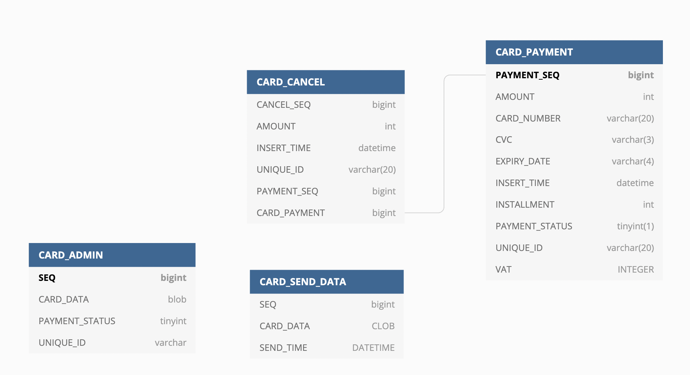

# paymentSystem

### 프레임워크 설명

* 개발 프레임워크: Java 11, H2 Embedded Database, Spring Boot Framework 2.4.1, Gradle, Gson, lombok 

### 테이블 명세



* CARD_ADMIN 테이블은 결제나 취소시 UNIQUE_ID를 관리하기 위한 테이블입니다.
  UNIQUE_ID 생성을 위해 AUTO_INCREASE를 활용한 SEQ를 발급받고 UNIQUE_ID를 생성합니다.
  
* CARD_PAYMENT 테이블은 결제 시 결제 내역 정보를 기록하기 위한 테이블입니다. 또한 취소시 취소 상태를 저장합니다.

* CARD_CANCEL 테이블은 취소 시 취소 내역 정보를 기록합니다. 부분 취소 모두 기록합니다.

* CARD_SEND_DATA 테이블은 카드사에 전송한 데이터 입니다. 전송의 역할만 할 뿐 어떤 데이터도 가져오지 않습니다.

### 문제 해결 전략 (추가 문제 개발하였습니다)

* Json으로 전송되는 요청의 키 값을 체크하기 위해 Body Data에서 Json 필드를 직접 가공하였습니다.

* 전송시 보내지는 Optional의 값이 없을 경우 내부적으로 -1로 셋팅하여 값 없음을 표기하도록 하였습니다.

* 요청을 받은 뒤 CARD_ADMIN 테이블에 INSERT 하여 SEQ를 발급받습니다. 중복되는 UNIQUE_ID를 발급하지 않기 위해 먼저 INSERT를 하였습니다.
UNIQUE_ID는 SEQ 값을 베이스로 생성합니다. 그리고 결제와 취소 테이블에 UNIQUE_ID를 SET하고 CARD_ADMIN 테이블에도 SET 하여 줍니다.

* 결제 시 부가세가 있는지 체크하여 계산해주며 명시 된 String Data 포맷에 맞추어 데이터를 형성하고 카드사에 전송합니다.

* 카드 결제/취소 내역을 불러올 시 CARD_ADMIN의 데이터를 이용하여 응답해줍니다.

* 카드 취소의 결제 내역이 있는지 체크하고 마찬가지로 부가세를 체크합니다. 계산하고 전체 취소는 한번만 가능하므로 CARD_CANCEL 테이블의 PAYMENT_STATUS를 이용하여 기록해 둡니다.
  
* 부분취소는 저장된 CARD_PAYMENT 테이블의 값이 있는지 체크한 뒤 조건에 맞는다면 CARD_PAYMENT 테이블의 AMOUNT(결제 금액), VAT(부가세)를 UPDATE 해줍니다.
AMOUNT와 VAT가 0이 될 경우 취소가 완료 되었으므로 PAYMENT_STATUS 값을 0으로 바꾸어 취소 완료를 나타내어 줍니다(추가적인 취소가 불가합니다).
  

### 빌드 실행 방법

```
gradlew build (맥, 리눅스)
gradlew.bat build(윈도우)
```
위의 명령어를 활용하여 테스트케이스를 모두 통과하도록 합니다.
이 후 프로젝트 내의 build/libs/폴더 안의 paymentSystem-0.0.1-SNAPSHOT.jar 파일을 jar 옵션을 통해 실행합니다.

```
java -jar paymentSystem-0.0.1-SNAPSHOT.jar
```

* 기본 포트는 8080입니다. application.yml 파일을 사용하여 변경 가능합니다.

### 프로토콜 정의서(긴 메시지는 짧게 하였습니다)
* 카드 결제
```
{
"cardNumber": 123456789011,
"expiryDate": 0123,
"cvc": 481,
"installment": 0,
"amount": 1000,
"vat": 0
}

{
"status": "OK",
"uniqueId": "12891764590000000001",
"cardData": " 446PAYMENT ..."
}

```
* 결제 내역
```
{
"uniqueId": "13891358310000000001"
}

{
"status": "OK",
"uniqueId": "13891358310000000001",
"cardNum": "123456***011",
"expiryDate": "0123",
"cvc": "481",
"isPayment": 0,
"amount": 1000,
"vat": 91
}
```
*결제 취소
```

{
"uniqueId": "13891358310000000001",
"amount" : 1091,
"vat": 0
}

{
"status": "OK",
"uniqueId": "13899044760000000005",
"cancelData": " 446CANCEL..."
}
```

*결제 취소(에러)
```
{
"uniqueId": "13891358310000000001",
"amount" : 1091,
"vat": 999
}


{
"errorCode": "NOT_EQUAL_TOTAL_AMOUNT",
"errorNumber": "P005",
"message": "not equal amount"
}
```

